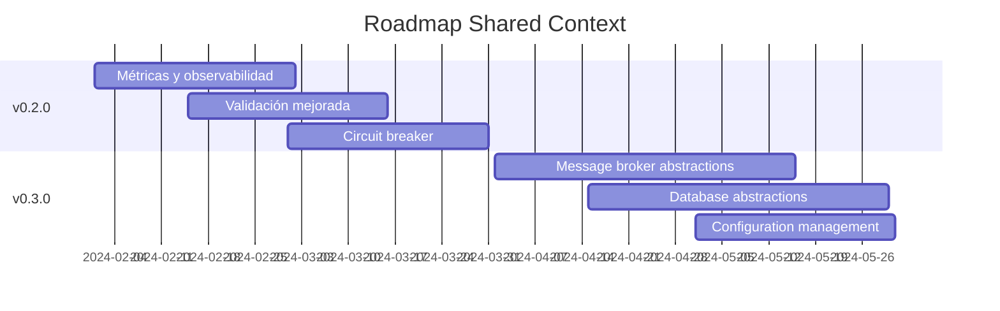

# Índice - Contexto Shared

Bienvenido a la documentación completa del **Contexto Shared** de Yurest. Esta sección contiene toda la información necesaria para entender, usar y contribuir al Shared Kernel siguiendo los principios de Domain-Driven Design.

## 📖 Documentación por Categoría

### 🏛️ **Domain Layer**
Primitivas de dominio puras, sin dependencias externas.

| Componente | Descripción | Documentación |
|------------|-------------|---------------|
| **Value Objects** | Primitivas inmutables con validación | [📖 Ver docs](./domain/value-objects.md) |
| **Domain Events** | Eventos de dominio para comunicación | [📖 Ver docs](./domain/domain-events.md) |
| **Domain Services** | Servicios puros de dominio | [📖 Ver docs](./domain/domain-services.md) |
| **Exception Handling** | Manejo de excepciones de dominio | [📖 Ver docs](./domain/exception-handling.md) |

### 🎯 **Application Layer**  
Patrones de aplicación y orquestación de use cases.

| Componente | Descripción | Documentación |
|------------|-------------|---------------|
| **CQRS Buses** | Command, Query y Event buses | [📖 Ver docs](./application/cqrs-buses.md) |
| **Cache Services** | Abstracciones de caché | [📖 Ver docs](./application/cache-services.md) |
| **Application Services** | Orquestación de casos de uso | [📖 Ver docs](./application/application-services.md) |

### 🔧 **Infrastructure Layer**
Implementaciones técnicas y utilidades de infraestructura.

| Componente | Descripción | Documentación |
|------------|-------------|---------------|
| **HTTP Client** | Cliente HTTP robusto y type-safe | [📖 Ver docs](./infrastructure/http-client.md) |
| **gRPC Client** | Cliente gRPC con protobuf | [📖 Ver docs](./infrastructure/grpc-client.md) |
| **Request Context** | Manejo de contexto de request | [📖 Ver docs](./infrastructure/request-context.md) |
| **Logging** | Configuración y logging estructurado | [📖 Ver docs](./infrastructure/logging.md) |
| **Middleware** | Middlewares para FastAPI | [📖 Ver docs](./infrastructure/middleware.md) |
| **Bootstrap** | Inicialización de aplicación | [📖 Ver docs](./infrastructure/bootstrap.md) |

## 📋 Documentación por Patrón

### **Patrones de Diseño**
| Patrón | Descripción | Documentación |
|--------|-------------|---------------|
| **Value Objects Pattern** | Inmutabilidad y validación | [📖 Ver docs](./patterns/value-objects-pattern.md) |
| **CQRS Pattern** | Separación de Command y Query | [📖 Ver docs](./patterns/cqrs-pattern.md) |
| **Request Context Pattern** | Correlación de traces | [📖 Ver docs](./patterns/request-context-pattern.md) |
| **Client Pattern** | Abstracción de clientes HTTP/gRPC | [📖 Ver docs](./patterns/client-pattern.md) |

### **Guías de Implementación**
| Guía | Descripción | Documentación |
|------|-------------|---------------|
| **Integración FastAPI** | Cómo integrar con FastAPI | [📖 Ver docs](./guides/fastapi-integration.md) |
| **Testing Strategies** | Estrategias de testing | [📖 Ver docs](./guides/testing-strategies.md) |
| **Performance** | Mejores prácticas de rendimiento | [📖 Ver docs](./guides/performance.md) |
| **Error Handling** | Manejo de errores robusto | [📖 Ver docs](./guides/error-handling.md) |

## 🚀 Quick Start

### **1. Primeros Pasos**
```bash
# Explorar la estructura
ls app/Contexts/Shared/

# Ver ejemplos básicos
python examples/value_objects_example.py
python examples/cqrs_example.py
python examples/http_client_example.py
```

### **2. Casos de Uso Comunes**

#### **🏷️ Crear Value Object**
```python
from app.Contexts.Shared.Domain.ValueObject.StringValueObject import StringValueObject

class Email(StringValueObject):
    def __init__(self, value: str):
        if "@" not in value:
            raise ValueError("Invalid email")
        super().__init__(value.lower())
```

#### **📋 Usar Command Bus**
```python
from app.Contexts.Shared.Application.Bus.Command.CommandBus import CommandBus

bus = container.get(CommandBus)
command = CreateUserCommand("John", "john@example.com")
bus.dispatch(command)
```

#### **🌐 Cliente HTTP**
```python
from app.Contexts.Shared.Infrastructure.Http.Client.HttpClient import HttpClient

with HttpClient("https://api.example.com") as client:
    response = client.send(MyRequest())
    data = response.json()
```

### **3. Integración con Tu Bounded Context**
```python
# En tu bounded context
from app.Contexts.Shared.Domain.ValueObject.StringValueObject import StringValueObject
from app.Contexts.Shared.Application.Bus.Command.Command import Command

# Crear value objects específicos
class OrderId(StringValueObject):
    pass

# Crear commands específicos  
class CreateOrderCommand(Command):
    def __init__(self, order_id: OrderId, items: list):
        self.order_id = order_id
        self.items = items
```

## 🎯 Casos de Uso por Funcionalidad

### **🔄 CQRS Implementation**
- ✅ [Command Bus](./application/cqrs-buses.md#command-bus) - Para modificar estado
- ✅ [Query Bus](./application/cqrs-buses.md#query-bus) - Para obtener datos  
- ✅ [Event Bus](./application/cqrs-buses.md#event-bus) - Para notificaciones

### **🌐 External Communication**
- ✅ [HTTP Client](./infrastructure/http-client.md) - APIs REST
- ✅ [gRPC Client](./infrastructure/grpc-client.md) - Microservicios gRPC

### **🏷️ Domain Modeling**
- ✅ [Value Objects](./domain/value-objects.md) - Primitivas de dominio
- ✅ [Domain Events](./domain/domain-events.md) - Eventos de negocio

### **🔍 Observability**
- ✅ [Request Context](./infrastructure/request-context.md) - Correlación de traces
- ✅ [Logging](./infrastructure/logging.md) - Logging estructurado

## 📊 Métricas y Estado

### **Cobertura de Tests**
- **Domain Layer**: 95%+ coverage
- **Application Layer**: 90%+ coverage  
- **Infrastructure Layer**: 85%+ coverage

### **Components Status**
| Componente | Estado | Versión | Última Actualización |
|------------|--------|---------|---------------------|
| Value Objects | ✅ Estable | v1.0 | 2024-01 |
| CQRS Buses | ✅ Estable | v1.0 | 2024-01 |
| HTTP Client | ✅ Estable | v1.0 | 2024-01 |
| gRPC Client | 🚧 Nuevo | v0.1 | 2024-01 |
| Request Context | ✅ Estable | v1.0 | 2024-01 |

## 🛠️ Para Desarrolladores

### **Contribuir al Shared Context**
1. **Entiende el patrón**: Lee sobre [Shared Kernel](https://martinfowler.com/bliki/BoundedContext.html)
2. **Sigue las capas DDD**: Respeta la separación Domain/Application/Infrastructure
3. **Añade tests**: Mantén alta cobertura de tests
4. **Actualiza docs**: Toda nueva funcionalidad debe estar documentada

### **Principios de Diseño**
- **🎯 Single Responsibility**: Una responsabilidad por clase
- **🔄 Open/Closed**: Abierto para extensión, cerrado para modificación
- **🔗 Dependency Inversion**: Depende de abstracciones
- **🧩 Interface Segregation**: Interfaces pequeñas y cohesivas

### **Roadmap de Desarrollo**


## 📞 Soporte y Recursos

### **Obtener Ayuda**
- **📚 Documentación**: Navega por las secciones anteriores
- **💬 Slack**: Canal `#shared-kernel` para preguntas
- **🐛 Issues**: Reporta problemas en el repositorio
- **📧 Email**: shared-kernel@yurest.com

### **Recursos Adicionales**
- **[Ejemplos de Código](../examples/)** - Implementaciones de ejemplo
- **[Tests de Referencia](../../tests/Contexts/Shared/)** - Tests como documentación
- **[ADRs](../decisions/)** - Decisiones arquitectónicas tomadas

### **Enlaces Útiles**
- [Domain-Driven Design](https://martinfowler.com/tags/domain%20driven%20design.html)
- [CQRS Pattern](https://martinfowler.com/bliki/CQRS.html)
- [Value Objects](https://martinfowler.com/bliki/ValueObject.html)
- [Shared Kernel](https://martinfowler.com/bliki/BoundedContext.html)

---

**📈 Última actualización**: Enero 2024  
**👥 Mantenedores**: Equipo Shared Kernel  
**📝 Versión docs**: v1.0 